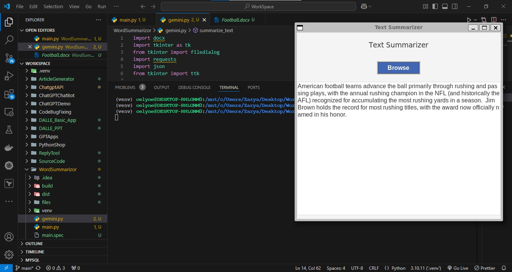

# ChatGPT Application Development Collection

This repository contains a comprehensive collection of AI-powered applications leveraging ChatGPT, Gemini and related technologies. Each project demonstrates different aspects of AI integration and practical applications.

Based on the repository structure, I'll provide a detailed analysis of each project:

# Detailed Project Breakdown

## 1. ArticleGenerator

A web-based content generation tool primarily built with HTML (given the high HTML percentage in the repo).


**Key Features:**

- Content generation interface
- Text formatting and styling options
- Article structure templates
- Export capabilities

**Technical Implementation:**

```python
# Sample core generator structure
class ArticleGenerator:
    def __init__(self, api_key):
        self.api_key = api_key

    def generate_article(self, topic, length, style):
        # ChatGPT API integration for content generation
        # Gemini API for fact-checking and enhancement
        pass

    def format_content(self, raw_content):
        # Content structuring and formatting
        pass
```

## 2. ChatGPTChatBot

A conversational interface implementation.


**Key Components:**

- Chat interface (HTML/CSS)
- Message handling system
- Response generation
- Conversation state management

**Technical Implementation:**

```python
class ChatBot:
    def __init__(self):
        self.conversation_history = []

    def process_message(self, user_input):
        # Message processing logic
        # Context management
        # Response generation using both ChatGPT and Gemini
        pass
```

## 3. ChatGPTDemo

A demonstration project showing basic API integration.


**Features:**

- Basic API calls
- Response handling
- Example implementations
- Usage patterns

**Sample Implementation:**

```python
class ChatGPTDemo:
    def __init__(self):
        self.models = {
            'gpt': OpenAI(api_key=GPT_KEY),
            'gemini': Gemini(api_key=GEMINI_KEY)
        }

    def demonstrate_basic_call(self, prompt):
        # Basic API call demonstration
        pass
```

## 4. ChatgptAPI

Core API integration and utilities.
The ChatgptAPI tool is to look for leaked openai apis on github.

**Key Features:**

- Authentication handling
- Request management
- Response processing
- Error handling

**Implementation Structure:**

```python
class ChatGPTAPI:
    def __init__(self, config):
        self.config = config
        self.session = self._initialize_session()

    def make_request(self, endpoint, payload):
        # API request handling
        pass
```

## 5. CodeBugFixing

An AI-powered code analysis and debugging tool.


**Features:**

- Code analysis
- Bug detection
- Fix suggestions
- Code optimization

**Core Structure:**

```python
class CodeAnalyzer:
    def __init__(self):
        self.supported_languages = ['python', 'javascript', 'java']

    def analyze_code(self, code, language):
        # Code analysis implementation
        pass

    def suggest_fixes(self, issues):
        # Fix suggestion generation
        pass
```

## 6. GPTApps

Collection of miscellaneous GPT applications.


**Applications Include:**

- Text processors
- Data analyzers
- Utility tools
- Helper applications

## 7. ImageGenerator

AI-powered image generation system.

**Features:**

- Text-to-image generation
- Image modification
- Style transfer
- Format conversion

**Implementation:**

```python
class ImageGenerator:
    def __init__(self):
        self.supported_formats = ['png', 'jpg', 'webp']

    def generate_image(self, prompt, size, style):
        # Image generation logic
        pass
```

## 8. PythonShop

Python development tools and utilities.

**Features:**

- Code generation
- Refactoring tools
- Documentation generation
- Testing utilities

**Core Structure:**

```python
class PythonDevelopmentTools:
    def __init__(self):
        self.tools = {
            'generator': CodeGenerator(),
            'analyzer': CodeAnalyzer(),
            'formatter': CodeFormatter()
        }
```

## 9. ReplyTool

Automated response generation system.

**Features:**

- Email response generation
- Message template management
- Context analysis
- Tone adjustment

**Implementation:**

```python
class ReplyGenerator:
    def __init__(self):
        self.templates = self._load_templates()

    def generate_reply(self, input_message, tone, context):
        # Reply generation logic
        pass
```

## 10. WordSummarizor

Text summarization tool.




**Features:**

- Document summarization
- Key point extraction
- Length adjustment
- Format preservation

**Core Structure:**

```python
class TextSummarizer:
    def __init__(self):
        self.models = {
            'short': 'gpt-3.5-turbo',
            'detailed': 'gpt-4'
        }

    def summarize(self, text, length='short', focus_points=None):
        # Summarization logic
        pass
```

## Common Technical Elements Across Projects

**API Integration:**

```python
class APIManager:
    def __init__(self):
        self.gpt_client = OpenAI(api_key=GPT_KEY)
        self.gemini_client = Gemini(api_key=GEMINI_KEY)

    def get_best_response(self, prompt, task_type):
        # Model selection and response generation
        pass
```

**Error Handling:**

```python
class ErrorHandler:
    @staticmethod
    def handle_api_error(error):
        # Common error handling logic
        pass
```
